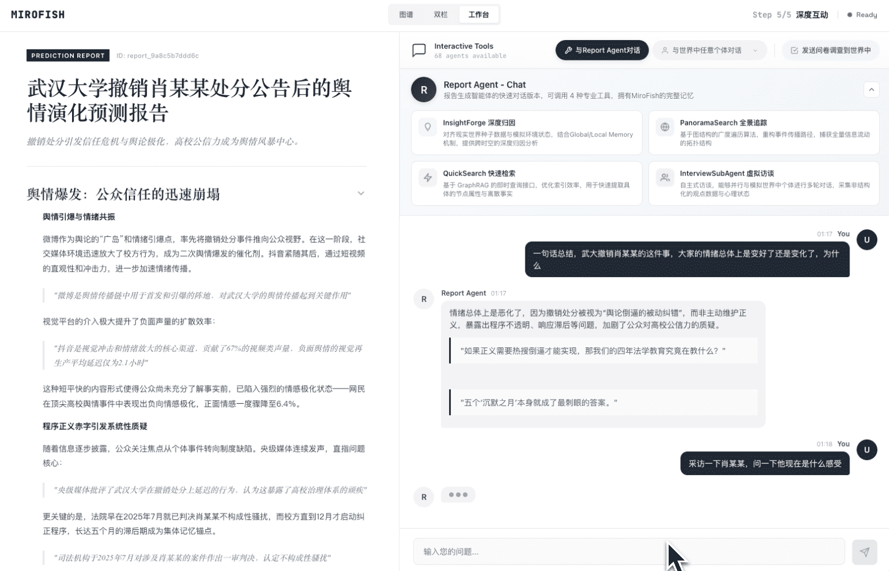
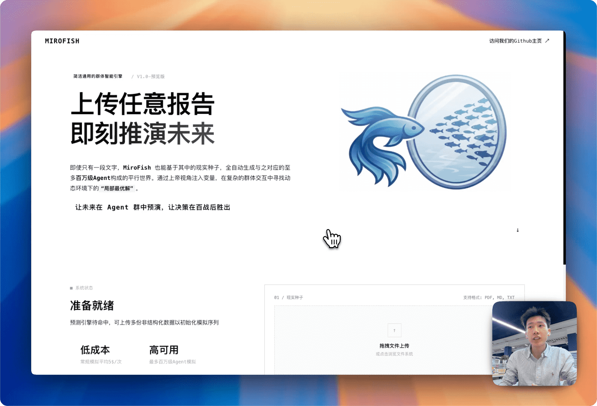

<div align="center">


<a href="https://trendshift.io/repositories/16144" target="_blank"></a>

Motor de Inteligência Coletiva Simples e Universal, Prevendo Tudo
</br>
<em>A Simple and Universal Swarm Intelligence Engine, Predicting Anything</em>

<a href="https://www.shanda.com/" target="_blank"></a>

[](https://github.com/666ghj/MiroFish/stargazers)
[](https://github.com/666ghj/MiroFish/watchers)
[](https://github.com/666ghj/MiroFish/network)
[](https://hub.docker.com/)
[](https://deepwiki.com/666ghj/MiroFish)

[](http://discord.gg/ePf5aPaHnA)
[](https://x.com/mirofish_ai)
[](https://www.instagram.com/mirofish_ai/)

[English](./README-EN.md) | [Português](./README.md)

</div>

## ⚡ Visão Geral do Projeto

**MiroFish** é um motor de predição de IA de nova geração baseado em tecnologia multi-agente. Ao extrair informações semente do mundo real (como notícias urgentes, projetos de políticas, sinais financeiros), constrói automaticamente um mundo digital paralelo de alta fidelidade. Neste espaço, milhares de agentes inteligentes com personalidades independentes, memória de longo prazo e lógica comportamental interagem livremente e passam por evolução social. Você pode injetar variáveis dinamicamente a partir de uma “visão de Deus” para deduzir com precisão trajetórias futuras — **ensaie o futuro em uma sandbox digital, e vença decisões após incontáveis simulações**.

> Você só precisa: Enviar materiais semente (relatórios de análise de dados ou histórias de romances interessantes) e descrever suas necessidades de predição em linguagem natural</br>
> O MiroFish retornará: Um relatório de predição detalhado e um mundo digital de alta fidelidade com interação profunda

### Nossa Visão

O MiroFish é dedicado a criar um espelho de inteligência coletiva que mapeia a realidade. Ao capturar a emergência coletiva desencadeada por interações individuais, superamos as limitações da predição tradicional:

- **No Nível Macro**: Somos um laboratório de ensaio para tomadores de decisão, permitindo que políticas e relações públicas sejam testadas com zero risco
- **No Nível Micro**: Somos uma sandbox criativa para usuários individuais — seja deduzindo finais de romances ou explorando cenários imaginativos, tudo pode ser divertido, lúdico e acessível

De predições sérias a simulações divertidas, permitimos que cada “e se” veja seu resultado, tornando possível prever tudo.

## 🌐 Demonstração Online

Bem-vindo ao ambiente de demonstração online, experimente uma simulação de predição sobre eventos de opinião pública em alta que preparamos para você: [mirofish-live-demo](https://666ghj.github.io/mirofish-demo/)

## 📸 Capturas de Tela do Sistema

<div align="center">
<table>
<tr>
<td></td>
<td></td>
</tr>
<tr>
<td></td>
<td></td>
</tr>
<tr>
<td></td>
<td></td>
</tr>
</table>
</div>

## 🎬 Vídeos de Demonstração

### 1. Simulação de Opinião Pública da Universidade de Wuhan + Apresentação do Projeto MiroFish

<div align="center">
<a href="https://www.bilibili.com/video/BV1VYBsBHEMY/" target="_blank"></a>

Clique na imagem para assistir ao vídeo completo de demonstração de predição usando o "Relatório de Opinião Pública da Universidade de Wuhan" gerado pelo BettaFish
</div>

### 2. Predição do Final Perdido de "O Sonho da Câmara Vermelha"

<div align="center">
<a href="https://www.bilibili.com/video/BV1cPk3BBExq" target="_blank"></a>

Clique na imagem para assistir à predição profunda do MiroFish sobre o final perdido, baseada em centenas de milhares de palavras dos primeiros 80 capítulos de "O Sonho da Câmara Vermelha"
</div>

> **Predição financeira**, **Predição de notícias políticas** e mais exemplos em breve...

## 🔄 Fluxo de Trabalho

1. **Construção do Grafo**: Extração de sementes reais & Injeção de memória individual e coletiva & Construção GraphRAG
2. **Configuração do Ambiente**: Extração de relações entre entidades & Geração de personas & Agente de configuração injeta parâmetros de simulação
3. **Iniciar Simulação**: Simulação paralela em duas plataformas & Análise automática de necessidades de predição & Atualização dinâmica de memória temporal
4. **Geração de Relatório**: O ReportAgent possui um rico conjunto de ferramentas para interação profunda com o ambiente pós-simulação
5. **Interação Profunda**: Converse com qualquer indivíduo no mundo simulado & Converse com o ReportAgent

## 🚀 Início Rápido

### Opção 1: Implantação via Código-Fonte (Recomendado)

#### Pré-requisitos

| Ferramenta | Versão | Descrição | Verificar Instalação |
|------|---------|------|---------|
| **Node.js** | 18+ | Ambiente de execução do frontend, inclui npm | `node -v` |
| **Python** | ≥3.11, ≤3.12 | Ambiente de execução do backend | `python --version` |
| **uv** | Última versão | Gerenciador de pacotes Python | `uv --version` |

#### 1. Configurar Variáveis de Ambiente

```bash
# Copiar arquivo de configuração de exemplo
cp .env.example .env

# Editar o arquivo .env e preencher as chaves de API necessárias
```

**Variáveis de ambiente obrigatórias:**

```env
# Configuração da API LLM (suporta qualquer API LLM no formato OpenAI SDK)
# Recomendado: modelo qwen-plus da plataforma Alibaba Bailian: https://bailian.console.aliyun.com/
# Atenção: consumo elevado, tente primeiro simulações com menos de 40 rodadas
LLM_API_KEY=your_api_key
LLM_BASE_URL=https://dashscope.aliyuncs.com/compatible-mode/v1
LLM_MODEL_NAME=qwen-plus

# Configuração Zep Cloud
# A cota gratuita mensal é suficiente para uso simples: https://app.getzep.com/
ZEP_API_KEY=your_zep_api_key
```

#### 2. Instalar Dependências

```bash
# Instalar todas as dependências de uma vez (raiz + frontend + backend)
npm run setup:all
```

Ou instalar passo a passo:

```bash
# Instalar dependências Node (raiz + frontend)
npm run setup

# Instalar dependências Python (backend, cria ambiente virtual automaticamente)
npm run setup:backend
```

#### 3. Iniciar Serviços

```bash
# Iniciar frontend e backend simultaneamente (executar na raiz do projeto)
npm run dev
```

**Endereços dos serviços:**
- Frontend: `http://localhost:3000`
- API do Backend: `http://localhost:5001`

**Iniciar individualmente:**

```bash
npm run backend   # Iniciar apenas o backend
npm run frontend  # Iniciar apenas o frontend
```

### Opção 2: Implantação via Docker

```bash
# 1. Configurar variáveis de ambiente (mesmo que implantação via código-fonte)
cp .env.example .env

# 2. Baixar imagem e iniciar
docker compose up -d
```

Por padrão, lê o `.env` do diretório raiz e mapeia as portas `3000 (frontend) / 5001 (backend)`

> No `docker-compose.yml` há um endereço de imagem espelho acelerada nos comentários, substitua conforme necessário

## 📬 Mais Contato

<div align="center">

</div>

&nbsp;

A equipe MiroFish está recrutando em tempo integral/estágio. Se você tem interesse em aplicações multi-agente, envie seu currículo para: **mirofish@shanda.com**

## 📄 Agradecimentos

**MiroFish recebeu suporte estratégico e incubação do Grupo Shanda!**

O motor de simulação do MiroFish é alimentado por **[OASIS](https://github.com/camel-ai/oasis)**. Agradecemos sinceramente a equipe CAMEL-AI por suas contribuições open-source!

## 📈 Estatísticas do Projeto

<a href="https://www.star-history.com/#666ghj/MiroFish&type=date&legend=top-left">
 <picture>
   <source media="(prefers-color-scheme: dark)" srcset="https://api.star-history.com/svg?repos=666ghj/MiroFish&type=date&theme=dark&legend=top-left" />
   <source media="(prefers-color-scheme: light)" srcset="https://api.star-history.com/svg?repos=666ghj/MiroFish&type=date&legend=top-left" />
   
 </picture>
</a>
